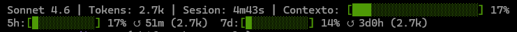

# Claude Code Statusline — Instalador PowerShell

Muestra en tiempo real en la parte inferior de Claude Code:

- Modelo activo | Tokens de sesión | Duración de sesión
- Barra de uso del contexto (con color según nivel)
- Barras de rate limit **5h** y **7d** con porcentaje y tiempo hasta reset



---

## Requisitos

- [Claude Code](https://claude.ai/code) instalado
- [Python 3](https://www.python.org/downloads/) instalado y en el PATH del sistema  
  _(durante la instalación marca **"Add Python to PATH"*)_

---

## Instalación

1. Descarga o clona este repositorio en cualquier carpeta del equipo.

2. Abre **PowerShell** (búscalo en el menú Inicio).

3. Si es la primera vez que ejecutas scripts en este equipo, habilita la ejecución:
   ```powershell
   Set-ExecutionPolicy -Scope CurrentUser RemoteSigned
   ```
   Confirma con `S`.

4. Navega hasta la carpeta y ejecuta el instalador:
   ```powershell
   .\install-statusline.ps1
   ```

5. **Reinicia Claude Code.**

El script crea automáticamente `~/.claude/statusline-command.py` y añade la configuración en `~/.claude/settings.json` **sin borrar ninguna configuración existente**.

---

## Qué hace el instalador

| Archivo generado | Descripción |
|---|---|
| `~/.claude/statusline-command.py` | Script Python que genera el statusline |
| `~/.claude/settings.json` | Añade la clave `statusline` con el comando |

---

## Sistema de colores

El texto del statusline se muestra en **blanco**. Solo las barras de progreso cambian de color según el porcentaje de uso:

| Rango | Color | Descripción |
|---|---|---|
| 0 – 49 % | 🟢 Verde | Uso bajo |
| 50 – 79 % | 🟠 Naranja | Uso medio |
| ≥ 80 % | 🔴 Rojo | Uso alto |

Se usan **códigos de color 256-color** (`\033[38;5;Nm`) en lugar de los 8 colores ANSI estándar. Esto garantiza que los colores se muestren correctamente en terminales con temas personalizados (como Kitty en Linux con paletas oscuras), donde los colores estándar pueden renderizarse de forma incorrecta.

---

## Desinstalación

1. Elimina la sección `statusline` de `~/.claude/settings.json`.
2. Borra `~/.claude/statusline-command.py` si lo deseas.

---

## Compatibilidad

| Sistema | Terminal | Estado |
|---|---|---|
| Windows 11 | PowerShell 5.1 / Windows Terminal | ✅ Probado |
| Linux (CachyOS) | Kitty | ✅ Probado |

> **Nota para Kitty en Linux:** Los colores ANSI estándar (8 colores básicos) pueden verse mal con ciertos temas de terminal. El script usa 256-color para evitarlo. Si los colores de las barras no se ven correctamente, verifica que tu terminal soporte 256 colores ejecutando: `echo $TERM` (debería devolver `xterm-256color`, `kitty` o similar).

Requiere Python 3 en el PATH.
